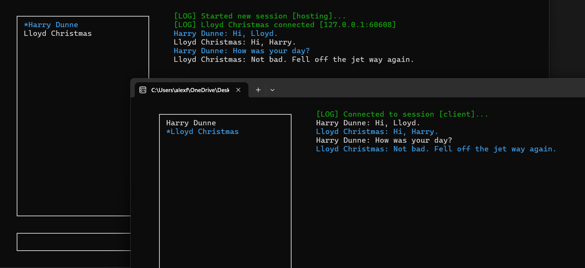

# ENetChat

Simple chat application using C++, ENet, and PDCurses (a multi-environment GUI library)

## Project Overview

* Leverages ENet as a simple, light-weight communication layer, built on top of UDP while also providing reliable, in-order communication
* Custom protocol definitions, along with custom serialization & deserializing using a byte stream to pack and unpack bytes as they are transmitted across the network
* Multi-threading to ensure the network listener and user input collection are separate and non-blocking
* Custom UI used to collect user input and display messages as they are sent & received

This project was largely intended as a learning experience, focused on lower-level networking concepts like serializing & deserializing data, managing a shared state between server-client, and architecting a multi-threaded application. (also, learning a bit of C++ along the way :relaxed:)

## Project Setup

If not done already, the included project dependencies (e.g. ENet, PDCurses) need to be linked to the "Chat" project

### Example
Navigate to the project properties (ex: `Client > Properties > Debug | x64`), then update:
- **VC++ Directories**
    - Include Directories (append the following): `$(SolutionDir)\Chat`
- **C/C++**
    - Additional Include Directories: `$(SolutionDir)\Dependencies\enet\include;$(SolutionDir)\Dependencies\PDCurses\include`
    - Additional #using Directories: `$(SolutionDir)\network`
- **Linker**
    - Additional Library Directories: `$(SolutionDir)\Dependencies\enet;$(SolutionDir)\Dependencies\PDCurses`
    - Additional Dependencies (append the following): `enet64.lib;ws2_32.lib;winmm.lib;pdcurses64.lib`
        - **NOTE**: use `enet.lib` and `pdcurses.lib` for Win32, `enet64.lib` and `pdcurses64.lib` for x64
